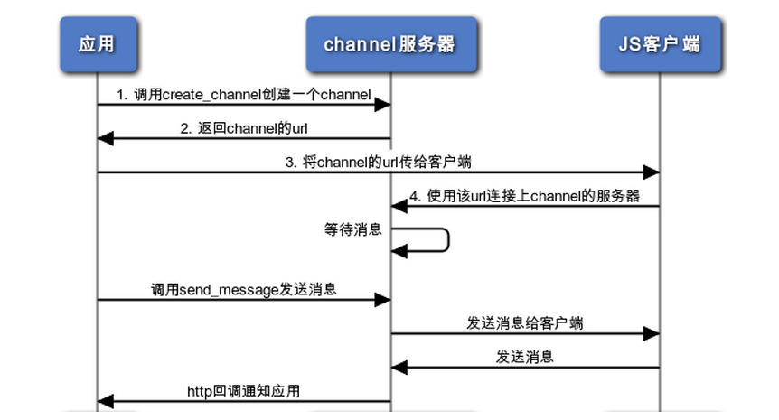

可用服务列表
=========================

注意：MySQL, TaskQueue, Memcache, KVDB 服务需开启才能使用，请在前端管理界面 `服务管理` 中开启并初始化。

访问互联网
-------------

直接使用urllib, urllib2或者httplib模块访问网络资源即可。

默认使用sae提供的fetchurl服务来抓取网页，对于fetchurl不支持的功能（HTTP代理等），可以禁用掉fetchurl服务，
使用socket服务来处理请求。 ::

    import os
    os.environ['disable_fetchurl'] = "1"

MySQL
------------

连接信息
~~~~~~~~~~~

获取mysql的连接信息。

.. module:: sae.const
   :synopsis: MYSQL连接信息

::

    import sae.const

    sae.const.MYSQL_DB      # 数据库名
    sae.const.MYSQL_USER    # 用户名
    sae.const.MYSQL_PASS    # 密码
    sae.const.MYSQL_HOST    # 主库域名（可读写）
    sae.const.MYSQL_PORT    # 端口，类型为<type 'str'>，请根据框架要求自行转换为int
    sae.const.MYSQL_HOST_S  # 从库域名（只读）

下面就可以跟平常一样使用MySQL服务了，SAE Python内置了MySQLdb模块，对于MySQLdb的使用，可以参考其 `官方文档`_ 。

.. _官方文档: http://mysql-python.sourceforge.net/MySQLdb.html

注意： MySQL 连接超时时间为30s 。

数据库管理
~~~~~~~~~~~~~~

你可以使用 `sae-python-dev` 包里的 `cloudsql.py` 这个mysql命令行客户端来管理数据库。详细见 :ref:`cloudsql.py`

SAE支持使用PHPMyAdmin来管理Mysql，点击管理面板 `服务管理 > MySQL > 管理MySQL` 即可进入。

开发时可使用本地mysql数据库，在发布时再将其导入到SAE线上数据库中。

.. note::

   导入sql文件时，请先删除所有的LOCK, UNLOCK语句。

   在管理界面创建数据表，默认字符集为utf8，也可设为其他编码。
   如果你是在本地开发环境建立的数据表，请确保使用utf8。在管理界面导入本地数据库时，
   也可完成字符集的转换。

TaskQueue, Cron
---------------

什么是任务
~~~~~~~~~~~~~
出于安全性考虑，SAE不支持执行一段任意的代码程序。SAE的cron，和unix的cron意义不同，没有相关联的程序。

SAE的任务，实际上对应于一个URL地址。SAE worker节点每请求一次该URL，就算执行一次任务。
真正的任务处理代码，是app中处理该URL的handler。

任务执行有两种方式: Taskqueue 动态执行任务, Cron 定时执行任务

任务的执行情况可以在日志中心>TaskQueue栏中查询。

Taskqueue
~~~~~~~~~~~~~~

.. module:: sae.taskqueue

.. py:function:: add_task(queue_name, url, payload=None, **kws)

   快速添加任务    

   queue_name: 任务队列的名称

   url: 任务的url，如： /tasks/task_name

   payload: 可选，如果payload存在且不为None，则该任务为一POST任务，payload会作为请求
   的POST的数据。

   delay/prior: 可选，使用方法参见Task。

.. py:class:: Task(url, payload=None, **kwargs)

   Task类
     
   url: 任务的url，如： /tasks/task_name

   payload: 可选, 如果payload存在且不为None，则该任务为一POST任务，payload会作为请求
   的POST的数据。

   delay: 可选，设置任务延迟执行的时间，单位为秒，最大可以为600秒。

   prior: 可选，如果设置为True，则任务会被添加到任务队列的头部。
 
.. py:class:: TaskQueue(name, auth_token=None)

   TaskQueue类

   name: 任务队列的名称。

   auth_token: 可选, 一个包含两个元素的元组 (access_key, secretkey_key)。
    
   .. py:method:: add(task)

      添加一个任务
          
      task: 添加的任务，可以为单个Task任务，也可以是一个Task列表。

   .. py:method:: size()

      获取当前队列中还有多少未执行的任务。

Example:

1. 添加一个任务。   ::
    
    from sae.taskqueue import Task, TaskQueue

    queue = TaskQueue('queue_name')
    queue.add(Task("/tasks/foo"))

2. 添加一个POST任务。   ::

    queue.add(Task("/tasks/bar", "data"))

3. 批量添加任务。   ::

    tasks = [Task("/tasks/update", user) for user in users]
    queue.add(tasks)

4. 快速添加任务。   ::

    from sae.taskqueue import add_task
    add_task('queue_name', '/tasks/push', 'msg')

..  note:: 

    任务的url现在已经改为相对的url，目前兼容绝对url，但是不推荐使用。 
    任务默认使用GET方式请求，如果Task带有payload参数且不为None则使用POST方式请求。

Cron
~~~~~~~~~~~~~~~~

Cron的配置文件为 `config.yaml` ，Cron的执行状态可在应用的管理界面 `服务管理>Cron` 中查看。

+   添加Cron:

    编辑config.yaml文件中，增加cron段，例如：   ::

        name: crontest
        version: 1
        cron:
        - description: cron_test
          url: /cron/make
          schedule: "*/5 * * * *"

    上面的示例添加了一个cron任务，
    该任务每5分钟执行 `http://crontest.sinaapp.com/cron/make` 一次。

+   删除cron:

    删除config.yaml中对应的cron描述段即可就行。

+   语法字段含义

    - url

      cron任务的url。例如 `/relative/url/to/cron` 。
     
    - schedule

      任务描述，也就是何时执行这个cron，支持unix crontab语法。例如：  ::

               # 每天00：05分执行
               "5 0 * * *"
               # 每月1号的14：15分执行
               "15 14 1 * *"
               # 每个工作日的晚上10点执行
               "0 22 * * 1-5"
               # 每分钟执行一次
               "*/1 * * * *"

      具体的语法规则可以参考man手册， `man 5 crontab`_ 。
        
    - description

      可选。任务的说明，默认为空。
     
    - timezone

      可选。默认为Beijing，目前支持：Beijing, NewYork, London, Sydney, Moscow, Berlin
     
    - login

      可选。http basic auth设置，格式： `用户名@密码`
     
    - times

      可选。设置cron最大执行的次数，默认没有次数限制。

.. _man 5 crontab: http://man.he.net/man5/crontab

..  note::

    Cron使用GET方式请求URL。

Cron 完整示例
~~~~~~~~~~~~~~~~~~~
每五分钟请求一次 /backend/cron/update URL

Flask URL 处理程序::

    import datetime
    import pylibmc as memcache

    from appstack import app

    mc = memcache.Client(['localhost'])

    @app.route('/backend/cron/update', methods=['GET', 'POST'])
    def update():
        update_time = mc.get('update_time')
        mc.set("update_time", str(datetime.datetime.now()))

        return update_time

config.yaml::

    name: appstack
    version: 4

    cron:
    - url: /backend/cron/update
      schedule: "*/5 * * * *"

Mail
-----------

Mail是SAE为开发者提供的邮件发送服务，用来异步发送标准SMTP邮件。Mail的日志可以在 `日志中心» Mail` 中查看。

..  module:: sae.mail

..  py:class:: EmailMessage(**kwargs)
    :module: sae.mail

    EmailMessage类

    参数同下面的initialize

    ..  py:method:: initialize(\**kwargs)

        初始化邮件的内容。

        to: 收件人，收件人邮件地址或者收件人邮件地址的列表。

        subject: 邮件的标题。

        body/html: 邮件正文。如果内容为纯文本，使用body，如果是html则使用html。

        smtp: smtp服务器的信息。是一个包含5个元素的tuple。
        (smtp主机，smtp端口， 邮件地址或用户名，密码，是否启用TLS）。

        from_addr: 可选。发件人，邮件的from字段，默认使用smtp的配置信息。

        attachments: 可选。邮件的附件，必须为一个list，list里每个元素为一个
        tuple，tuple的第一个元素为文件名，第二个元素为文件的内容。

    ..  py:method:: send

        提交邮件发送请求至后端服务器。

    ..  py:method:: __setattr__(attr, value)

        attr: 属性名。 value: 属性的值。

..  py:function:: send_mail(to, subject, body, smtp, **kwargs)
    :module: sae.mail

    快速发送邮件。

    字段的意义同EmailMessage.initialize()。
    

Examle:

1.  快速发送一份邮件 ::

        from sae.mail import send_mail

        send_mail("katherine@vampire.com", "invite", "to tonight's party",
                  ("smtp.vampire.com", 25, "damon@vampire.com", "password", False))

2.  发送邮件给多个收件人 ::

        to = ["katherine@vampire.com", 'rebecca@vampire.com', 'elena@vampire.com']
        send_mail(to, "invite", "to tonight's party",
                  ("smtp.vampire.com", 25, "damon@vampire.com", "password", False))
    

2.  发送一封html格式的邮件 ::

        from sae.mail import EmailMessage

        m = EmailMessage()
        m.to = 'damon@vampire.com'
        m.subject = 'Re: inivte'
        m.html = '<b>my pleause!</b>'
        m.smtp = ('smtp.vampire.com', 25, 'katherine@vampire.com', 'password', False)
        m.send()

3.  使用Gmail SMTP  ::

        import sae.mail

        sae.mail.send_mail(to, subject, body,
                ('smtp.gmail.com', 587, from, passwd, True))

Memcache
-----------
请在前端管理界面启用Memcache服务。

..  module:: pylibmc
    :synopsis: memcache模块

SAE Python使用 http://sendapatch.se/projects/pylibmc/ 作为mc客户端。
不同之处在于，创建Client时不用指定servers参数（如果指定了会被忽略）。

示例代码::

    import pylibmc as memcache

    mc = memcache.Client()
 
    mc.set("foo", "bar")
    value = mc.get("foo")
 
    if not mc.get('key'):
        mc.set("key", "1")
    mc.incr("key")

pylibmc接口和 `python-memcached`_ 基本兼容，可以直接替换使用。 `python-memcache文档 <_static/memcache.html>`_ 。

对于现有使用python-memcache的代码，可以直接在index.wsgi中（任何import memcache语句执行之前）加入如下代码，即可不修改代码使用pylibmc了。 ::

    import pylibmc
    import sys
    sys.modules['memcache'] = pylibmc

.. _python-memcached: http://www.tummy.com/Community/software/python-memcached/

Storage
----------

Storage是SAE为开发者提供的分布式文件存储服务，用来存放用户的持久化存储的文件。

用户需要先在storage的管理面板中创建保存数据的容器（bucket）。bucket中保存实际的数据（object）。

.. note:: 这里的bucket就是管理面板中的domain。

Tutorial
~~~~~~~~~~~

在SAE runtime中操作storage  ::

    >>> # 创建一个bucket的instance
    >>> from sae.storage import Bucket
    >>> bucket = Bucket('t')

    >>> # 创建该bucket
    >>> bucket.put()

    >>> # 修改该bucket的acl和缓存过期时间。
    >>> bucket.post(acl='.r:.sinaapp.com,.r:sae.sina.com.cn', metadata={'expires': '1d'})

    >>> # 获取该bucket的属性信息
    >>> attrs = bucket.stat()
    >>> print attrs
    {'acl': '.r:.sinaapp.com,.r:sae.sina.com.cn',
     'bytes': '0',
     'metadata': {'expires': '1d'},
     'objects': '0'}
    >>> attrs.acl
    '.r:.sinaapp.com,.r:sae.sina.com.cn'

    >>> # 存取一个字符串到bucket中
    >>> bucket.put_object('1.txt', 'hello, world')

    >>> # 获取object的public url
    >>> bucket.generate_url('1.txt')
    'http://pylabs-t.stor.sinaapp.com/1.txt'

    >>> # 存取一个文件到bucket中
    >>> bucket.put_object('2.txt', open(__file__, 'rb'))
    
    >>> # 列出该bucket中的所有objects
    >>> [i for i in bucket.list()]
    [{u'bytes': 12,
      u'content_type': u'text/plain',
      u'hash': u'e4d7f1b4ed2e42d15898f4b27b019da4',
      u'last_modified': u'2013-05-22T05:09:32.259140',
      u'name': u'1.txt'},
     {u'bytes': 14412,
      u'content_type': u'rb',
      u'hash': u'99079422784f6cbfc4114d9b261001e1',
      u'last_modified': u'2013-05-22T05:12:13.337400',
      u'name': u'2.txt'}]

    >>> # 获取object的所有属性
    >>> bucket.stat_object('1.txt')
    {'bytes': '12',
     'content_type': 'text/plain',
     'hash': 'e4d7f1b4ed2e42d15898f4b27b019da4',
     'last_modified': '2013-05-22T05:09:32.259140',
     'metadata': {},
     'timestamp': '1369199372.25914'}

    >>> # 取object的内容
    >>> bucket.get_object_contents('1.txt')
    'hello, world'

    >>> # 取文件的内容，返回generator
    >>> chunks = bucket.get_object_contents('2.txt', chunk_size=10)
    <generator object _body at 0x95ec20c>
    >>> chunks.next()      # 显示第一个chunk
    '\n# Copyrig'

    >>> # 删除objects
    >>> bucket.delete_object('1.txt')
    >>> bucket.delete_object('2.txt')

    >>> # 删除bucket
    >>> bucket.delete()

storage中不支持创建实际的目录，但是用户可以通过在object name中加入 `/` 来模拟目录结构。例如： ::

    >>> bucket.put_object('a/1.txt', '')
    >>> bucket.put_object('a/b/2.txt', '')

    >>> # 列出根目录下的所有objects。
    >>> [i for i in bucket.list(path='')]
    [{u'bytes': None,
      u'content_type': None,    # content_type为None表示这是一个子目录
      u'hash': None,
      u'last_modified': None,
      u'name': 'a/'}]

    >>> # 列出a目录下的objects
    >>> [i for i in bucket.list(path='a/')]
    [{u'bytes': 0,
      u'content_type': u'text/plain',
      u'hash': u'd41d8cd98f00b204e9800998ecf8427e',
      u'last_modified': u'2013-05-23T03:01:59.051030',
      u'name': u'a/1.txt'},
     {u'bytes', None,
      u'content_type': None,    # content_type为None表示这是一个子目录
      u'hash': None,
      u'last_modified': None,
      u'name': u'a/b/'}]

.. note:: 在list目录（除了根目录）时路径的末尾要带上 / 。

如果是在外部，SAE storage支持swift协议，用户也可以直接使用 `python-swiftclient`_ 客户端来操作storage。 ::

    $ pip install python-swiftclient
    $ export ST_AUTH='https://auth.sinas3.com/v1.0'
    $ export ST_USER='<your-accesskey>'
    $ export ST_KEY='<your-secretkey>'
    $ swift -h

.. _python-swiftclient: https://pypi.python.org/pypi/python-swiftclient

API Reference
~~~~~~~~~~~~~~~~

..  module:: sae.storage

..  py:class:: Error()

    Storage异常类。

..  module:: sae.storage

..  py:class:: Connection(accesskey=ACCESS_KEY, secretkey=SECRET_KEY, account=APP_NAME, retries=3)

    Connection类

    accesskey: 可选。storage归属的应用的accesskey，默认为当前应用。

    secretkey: 可选。storage归属的应用的secretkey，默认为当前应用。

    account: 可选。storage归属的应用的应用名，默认为当前应用。

    retries: 请求失败时重试的次数。

    .. py:method:: get_bucket(bucket)

       获取一个bucket类的instance。

       bucket: bucket的名称。

..  module:: sae.storage

..  py:class:: Bucket(bucket, conn=None)

    Bucket类，封装了大部分的storage操作。

    bucket: bucket的名称。

    conn: 可选。一个sae.storage.Connection的实例。

    .. py:method:: put(acl=None, metadata=None)

       创建一个bucket。

       acl: bucket的 :ref:`about-acl` (Access Control List)。

       metadata: 需要保存的元数据，metadata应该是一个dict，例如 `{'color': 'blue'}` 。

    .. py:method:: post(acl=None, metadata=None)

       修改bucket的acl和metadata。其中metadata的修改为增量修改。

    .. py:method:: list(prefix=None, delimiter=None, path=None, limit=10000, marker=None)

       列出bucket中的object。

       prefix: object名称的前缀。

       delimiter: 分割字符。折叠包含该分割字符的条目。

       path: 返回路径path下的全部objects。等价于prefix为path，delimiter为/。

       limit: 最大返回的objects条数。

       marker: 返回object名为marker后面的结果（不包含marker）。

       返回符合条件的objects的属性的一个generator。

    .. py:method:: stat()

       返回当前bucket的属性信息。

    .. py:method:: delete()

       删除bucket。被删除的bucket必须已经清空（没有任何object）。

    .. py:method:: put_object(obj, contents, content_type=None, content_encoding=None, metadata=None)

       创建或更新一个object。

       obj: object的名称。

       contents: object的内容，可以是字符串或file-like object。

       content_type: object的mime类型。

       content_encoding: object的encoding。

       metadata: object的元数据。

    .. py:method:: post_object(obj, content_type=None, content_encoding=None, metadata=None)

       更新object的一些属性。

       注意：object的metadata的更新是全量的，和container的增量修改不一样。

    .. py:method:: get_object(obj, chunk_size=None)

       获取object的内容和属性信息。

       obj: object的名称。

       chunk_size: 不返回object的全部内容，而是返回一个文件内容的generator，每次iterate返回chunk_size大小的数据。

       返回一个tuple (obj的属性信息, object的内容)。

    .. py:method:: get_object_contents(obj, chunk_size=None)

       获取object的内容。

       参数同get_object，只返回object的内容。

    .. py:method:: stat_object(obj)

       获取object的属性信息。

    .. py:method:: delete_object(obj)

       删除object。

    .. py:method:: generate_url(obj)

       返回object的public url。

.. _about-acl:

ACL
~~~~~~~~~~

ACL的格式是： `[item[,item...]]` 。 每一个item指定了一个referer的访问权限，item的格式为： `.r:[-]value` 。 

+ value可以为 `*` （任何referrer host都可以访问）
+ 如果value的开头包含 `.` 或者 `*` ，则其为一个域名通配。
  比如： `.example.com` 或者 `*.example.com` 。表示以.example.com结尾的referer host可以访问。
+ 在value的前面加上 `-` 则表示禁止referer host为这一域名的访问。
+ acl为空时表示不允许任何referer host的访问，也就等于该bucket为私有bucket。

例：  ::

    .r:*
    .r:-.thief.com
    .r:.example.com,.r:-thief.example.com

缓存过期
~~~~~~~~~~~~~~

如果用户没有设置bucket或者object的缓存过期时间，storage默认的时间是2小时。

用户可以通过以下metadata设置object的缓存过期时间: ::

    expires       该metadata可以加在bucket或者object上，用来设置object的缓存过期。
                  其value的格式为：[modified] time_delta

    expires-type  该metadata可以加在bucket上。对于该bucket中的object，按照其mime_type来设置对应的缓存过期时间。
                  其value的格式为：mime_type [modified] time_delta
                  如果有多条规则，规则和规则之间使用逗号（，）隔开。

mime_type为object的mime类型，例如： text/html, text/plain, image/gif

time_delta是一个表示时间的字符串，例如： `1y3M`, `48d`, `5s`, `-1` ::

    s   seconds
    m   minutes
    h   hours
    d   days
    w   weeks
    M   months, 30 days
    y   years, 365 days

modified关键字用于指定缓存过期的时间相对于object的最后修改时间。默认expire时间是相对于访问时间。

如果time_delta为负， Cache-Control header会被设置为no-cache. 

正的time_delta会设置Cache-Control为max-age = #，其中 # 是缓存过期的时间（单位为秒）。

模拟storage为文件系统
~~~~~~~~~~~~~~~~~~~~~~

::

    from sae.ext.storage import monkey
    monkey.patch_all()

以上代码会将storage ‘挂载’到 `/s/` 目录下，每个bucket为这个目录下的一个子目录。用户可以使用 `/s/<bucket-name>/<object-name>` 这样形式的路径通过文件系统接口来访问storage的中的object。

目前支持（patch）的文件系统接口函数为： `open, os.listdir, os.mkdir, os.path.exists, os.path.isdir, os.open, os.fdopen, os.close, os.chmod, os.stat, os.unlink, os.rmdir`

KVDB
----------

kvdb服务使用前需要在 `管理面板`_ 中启用，不再使用时可以在面板中禁用，禁用会删除所有数据。

.. _管理面板: http://sae.sina.com.cn/?m=kv

..  module:: sae.kvdb

..  py:class:: Error
    :module: sae.kvdb

    通用错误

..  py:class:: RouterError
    :module: sae.kvdb

    路由meta信息错误

..  py:class:: StatusError
    :module: sae.kvdb

    kvdb状态不为OK

..  py:class:: KVClient(debug=0)
    :module: sae.kvdb

    debug 是否输出详细调试、错误信息到日志，默认关闭

    .. py:method:: set(key, val, min_compress_len=0)

       设置key的值为val

       min_compress_len 启用zlib.compress压缩val的最小长度，如果val的长度大于此值
       则启用压缩，0表示不压缩。

    .. py:method:: add(key, val, min_compress_len=0)

       同set，但只在key不存在时起作用

    .. py:method:: replace(key, val, min_compress_len=0)

       同set，但只在key存在时起作用

    .. py:method:: delete(key)

       删除key。

    .. py:method:: get(key)

       从kvdb中获取一个key的值，存在返回key的值，不存在则返回None

    .. py:method:: get_multi(keys, key_prefix='')

       从kvdb中一次获取多个key的值。返回一个key/value的dict。

       keys: key的列表，类型必须为list。

       key_prefix: 所有key的前缀。请求时会在所有的key前面加上该前缀，返回值里所有的key都会去掉该前缀。

    .. py:method:: get_by_prefix(prefix, limit=100, marker=None)

       从kvdb中查找指定前缀的 key/value pair。返回一个generator，yield的item为一个(key, value)的tuple。

       prefix: 需要查找的key的前缀。

       limit: 最多返回的item个数，默认为100。

       marker: 指定从哪一个key开始继续查找，只返回该key后面的结果（该key不含在内）。

    .. py:method:: getkeys_by_prefix(prefix, limit=100, marker=None)

       从kvdb中查找指定前缀的key。返回符合条件的key的generator。

       prefix: 需要查找的key的前缀。

       limit: 最多返回的key的个数，默认为100。

       marker: 指定从哪一个key开始继续查找，只返回该key后面的结果（该key不含在内）。

    .. py:method:: get_info()

       获取本应用kvdb统计数据，返回一个字典::

            {
                'outbytes': 126, 
                'total_size': 3, 
                'inbytes': 180, 
                'set_count': 60,
                'delete_count': 21, 
                'total_count': 1, 
                'get_count': 42
            }

    .. py:method:: disconnect_all()
        
       关闭kvdb连接

示例代码: ::

    import sae.kvdb

    kv = sae.kvdb.KVClient()

    k = 'foo'
    kv.set(k, 2)
    kv.delete(k)

    kv.add(k, 3)
    kv.get(k)

    kv.replace(k, 4)
    kv.get(k)

    print kv.get_info()

服务限制:

+ 存储空间：100G
+ 最大记录条数：1,000,000,000
+ key的最大长度：200 Bytes
+ value的最大长度：4M
+ get_multi获取的最大KEY个数：32

SOCKET
-----------------

直接使用socket模块即可。目前仅支持AF_INET, SOCK_STREAM连接，暂时不支持异步socket。bind/listen方法无法使用。

Channel
--------------

概述
~~~~~~~

channel是sae提供的实时消息推送服务。通过在浏览器和SAE服务端之间建立长连接，使得应用可以方便的向javascript客户端实时的推送消息。

下图为channel服务的大致使用流程:

channel服务的使用主要包含两个部分：JS客户端，服务端处理程序。

对于JS客户端，其需要完成：

+ 使用应用服务端创建的channel url连接上channel的服务器。
+ 设置下行消息的处理函数。
+ 需要发送消息时，调用send发送消息给channel服务器（或者直接使用XMLHttpRequest直接发送给应用服务端也可）。

对于应用的服务端：

+ 调用create_channel为每个客户端创建一个channel，并将channel的url返回给客户端。
+ 处理channel server发过来的客户端上行消息（如果有的话）。
+ 有消息要发送时，调用send_message来向客户端推送消息。

当JS客户端和channel服务端连接上/断开或者当JS客户端有发送消息给channel服务器时，channel服务器会使用http回调的方式通知应用。

=========================== ============================================================
回调地址                    事件说明
=========================== ============================================================
/_sae/channel/connected     客户端连接上channel服务器
/_sae/channel/disconnected  客户端和channel服务器断开
/_sae/channel/message       客户端有上行消息，POST内容的message字段为JS客户端发送的内容
=========================== ============================================================

所有的http回调都使用POST方法。所有http回调的POST内容中的from字段为客户端对应channel的名称。其余字段（如果有）见具体回调说明。

Server端API：

.. module:: sae.channel

.. py:function:: create_channel(name, duration=None)

   创建一个channel。

   name: channel的名称。

   duration: channel的有效时间，单位为秒，默认为1小时。

.. py:function:: send_message(name, message)

   向名为name的channel里发送一条消息

   name: channel的名称

   message: 需要发送的消息内容

.. warning:: 最大可以发送4k的消息，最好不要直接发送二进制的数据。

Javascript客户端API：

在html页面中使用以下代码引用channel服务的js库。 ::

    

.. js:class:: sae.Channel(url)

   :param string url: 服务端create_channel()返回的url地址

   .. js:attribute:: onopen 

      设置客户端连接上服务端时的回调函数。

   .. js:attribute:: onmessage

      设置客户端收到消息时的回调函数。该函数接受一个参数：一个messagae对象，其中的data字段为服务端send_message接口发送的消息内容。

   .. js:attribute:: onerror

      设置客户端和服务端连接出现错误时的回调函数。

   .. js:attribute:: onclose

      设置客户端关闭和服务端的连接时的回调函数。

服务使用示例
~~~~~~~~~~~~~~

下面我们使用 `TicTacToe(井字棋)`_ 游戏来示范channel服务的使用方法：

.. _TicTacToe(井字棋): http://zh.wikipedia.org/wiki/%E4%BA%95%E5%AD%97%E6%A3%8B

完整代码：https://github.com/sinacloud/sae-channel-examples/tree/master/python

**channel的创建和连接**

首先，当用户A打开TicTacToe游戏的主页时，TicTacToe服务端的程序会：

+ 调用 `create_channel` 创建为用户A创建一个channel，并将该channel的url嵌入到返回给用户的html页面代码中。
+ 生成一个加入游戏的连接，用户通过将此连接发送给其它用户B，其它用户B可以通过此连接加入用户A创建的游戏。

每个页面对应的channel的name应该是独一无二的，比如可以使用用户id的字符串作为channel的name。

游戏的主页的html代码模板大致如下所示，其中 `{{ url }}` 和 `{{ game_link }}` 分别为上面生成的channel url和游戏加入连接。 ::

    <head>
    ...
    
    </head>
    <body>
      

      ...

      

        Waiting for another player to join. 
        Send them this link to play: 
        
<a href='{{ game_link }}'>{{ game_link }}</a>

      

    </body>

游戏的js客户端使用 `sae.Channel` 来创建一条channel连接，并且设置channel的onopen/onmessage/onerror/onclose的callback函数。

**使用channel来推送游戏状态信息**

当用户B点击用户A发过来的连接打开了游戏页面时，游戏的javascript客户端通过 `sendMessage` 函数通知服务端。 ::

    onOpened = function() {
      connected = true;
      sendMessage('opened');
      updateBoard();
    };

    sendMessage = function(path, opt_param) {
      path += '?g=' + state.game_key;
      if (opt_param) {
        path += '&' + opt_param;
      }
      var xhr = new XMLHttpRequest();
      xhr.open('POST', path, true);
      xhr.send();
    };

服务端更新当前游戏的状态，并且通过channel的 `send_message` 将游戏的新的状态发送给用户A和用户B的channel客户端。客户端接受到消息后更新游戏页面。此后用户A和用户B交替走棋，客户端通过 `sendMessage` 将用户的走法发送给服务端。 ::

    moveInSquare = function(id) {
      if (isMyMove() && state.board[id] == ' ') {
        sendMessage('/move', 'i=' + id);
      }
    }

服务收到消息后更新游戏的状态，再通过 `send_message` 将更新后的状态发送给用户A和B，如此往复直到游戏结束为止。 ::

    class MovePage(tornado.web.RequestHandler):

      def post(self):
        game_key = self.get_argument('g')
        game = Game.get_by_key_name(game_key)
        user = self.get_secure_cookie('u')
        if game and user:
          id = int(self.get_argument('i'))
          GameUpdater(game).make_move(id, user)

    class GameUpdater():
      game = None

      def __init__(self, game):
        self.game = game

      def get_game_message(self):
        gameUpdate = {
          'board': self.game.board,
          'userX': self.game.userX,
          'userO': '' if not self.game.userO else self.game.userO,
          'moveX': self.game.moveX,
          'winner': self.game.winner,
          'winningBoard': self.game.winning_board
        }
        return json.dumps(gameUpdate)

      def send_update(self):
        message = self.get_game_message()
        channel.send_message(self.game.userX + self.game.key_name, message)
        if self.game.userO:
          channel.send_message(self.game.userO + self.game.key_name, message)

      def check_win(self):
        if self.game.moveX:
          # O just moved, check for O wins
          wins = Wins().o_wins
          potential_winner = self.game.userO
        else:
          # X just moved, check for X wins
          wins = Wins().x_wins
          potential_winner = self.game.userX
          
        for win in wins:
          if win.match(self.game.board):
            self.game.winner = potential_winner
            self.game.winning_board = win.pattern
            return

      def make_move(self, position, user):
        if position >= 0 and user == self.game.userX or user == self.game.userO:
          if self.game.moveX == (user == self.game.userX):
            boardList = list(self.game.board)
            if (boardList[position] == ' '):
              boardList[position] = 'X' if self.game.moveX else 'O'
              self.game.board = "".join(boardList)
              self.game.moveX = not self.game.moveX
              self.check_win()
              self.game.put()
              self.send_update()
              return

GameUpdater类检查move的请求是否合法，如果合法则更新游戏的状态并且通知游戏双方新的游戏状态。

.. note::

   1. 每个html页面最多可以建立1个channel连接。
   2. 每个创建的channel只允许一个channel客户端连接。

中文分词
-------------------

**分词服务请求**

SAE分词服务请求采用以下形式的HTTP网址： ::

    http://segment.sae.sina.com.cn/urlclient.php?parameters

parameters为请求参数，多个参数之间使用&分割，以下列出了这些参数和其可能的值。

* encoding: 请求分词的文本的编码，可以为: GB18030、UTF-8、UCS-2。
* word_tag: 可选。是否返回词性数据。0表示不返回，1表示返回。

请求分词的文本以post的形式提交。

* context: 请求分词的文本。目前限制文本大小最大为10KB。

**分词服务响应**

分词服务的响应数据为json格式，格式如下： ::

    [
        {"word":"采莲","word_tag":"171","index":"1"},
        {"word":"赋","word_tag":"170","index":"2"}
    ]

响应数据为一个list，list中每个元素为一个dict，每个dict中包含以下数据：

* index: 序列号，按在请求文本中的位置依次递增。
* word: 单词
* word_tag: 单词的词性，仅当输入parameters里word_tag为1时包含该项。

词性代码： ::

    0   POSTAG_ID_UNKNOW 未知
    10  POSTAG_ID_A      形容词
    20  POSTAG_ID_B      区别词
    30  POSTAG_ID_C      连词
    31  POSTAG_ID_C_N    体词连接
    32  POSTAG_ID_C_Z    分句连接
    40  POSTAG_ID_D      副词
    41  POSTAG_ID_D_B    副词("不")
    42  POSTAG_ID_D_M    副词("没")
    50  POSTAG_ID_E      叹词
    60  POSTAG_ID_F      方位词
    61  POSTAG_ID_F_S    方位短语(处所词+方位词)
    62  POSTAG_ID_F_N    方位短语(名词+方位词“地上”)
    63  POSTAG_ID_F_V    方位短语(动词+方位词“取前”)
    64  POSTAG_ID_F_Z    方位短语(动词+方位词“取前”)
    70  POSTAG_ID_H      前接成分
    71  POSTAG_ID_H_M    数词前缀(“数”---数十)
    72  POSTAG_ID_H_T    时间词前缀(“公元”“明永乐”)
    73  POSTAG_ID_H_NR   姓氏
    74  POSTAG_ID_H_N    姓氏
    80  POSTAG_ID_K      后接成分
    81  POSTAG_ID_K_M    数词后缀(“来”--,十来个)
    82  POSTAG_ID_K_T    时间词后缀(“初”“末”“时”)
    83  POSTAG_ID_K_N    名词后缀(“们”)
    84  POSTAG_ID_K_S    处所词后缀(“苑”“里”)
    85  POSTAG_ID_K_Z    状态词后缀(“然”)
    86  POSTAG_ID_K_NT   状态词后缀(“然”)
    87  POSTAG_ID_K_NS   状态词后缀(“然”)
    90  POSTAG_ID_M      数词
    95  POSTAG_ID_N      名词
    96  POSTAG_ID_N_RZ   人名(“毛泽东”)
    97  POSTAG_ID_N_T    机构团体(“团”的声母为t，名词代码n和t并在一起。“公司”)
    98  POSTAG_ID_N_TA   ....
    99  POSTAG_ID_N_TZ   机构团体名("北大")
    100 POSTAG_ID_N_Z    其他专名(“专”的声母的第1个字母为z，名词代码n和z并在一起。)
    101 POSTAG_ID_NS     名处词
    102 POSTAG_ID_NS_Z   地名(名处词专指：“中国”)
    103 POSTAG_ID_N_M    n-m,数词开头的名词(三个学生)
    104 POSTAG_ID_N_RB   n-rb,以区别词/代词开头的名词(该学校，该生)
    107 POSTAG_ID_O      拟声词
    108 POSTAG_ID_P      介词
    110 POSTAG_ID_Q      量词
    111 POSTAG_ID_Q_V    动量词(“趟”“遍”)
    112 POSTAG_ID_Q_T    时间量词(“年”“月”“期”)
    113 POSTAG_ID_Q_H    货币量词(“元”“美元”“英镑”)
    120 POSTAG_ID_R      代词
    121 POSTAG_ID_R_D    副词性代词(“怎么”)
    122 POSTAG_ID_R_M    数词性代词(“多少”)
    123 POSTAG_ID_R_N    名词性代词(“什么”“谁”)
    124 POSTAG_ID_R_S    处所词性代词(“哪儿”)
    125 POSTAG_ID_R_T    时间词性代词(“何时”)
    126 POSTAG_ID_R_Z    谓词性代词(“怎么样”)
    127 POSTAG_ID_R_B    区别词性代词(“某”“每”)
    130 POSTAG_ID_S      处所词(取英语space的第1个字母。“东部”)
    131 POSTAG_ID_S_Z    处所词(取英语space的第1个字母。“东部”)
    132 POSTAG_ID_T      时间词(取英语time的第1个字母)
    133 POSTAG_ID_T_Z    时间专指(“唐代”“西周”)
    140 POSTAG_ID_U      助词
    141 POSTAG_ID_U_N    定语助词(“的”)
    142 POSTAG_ID_U_D    状语助词(“地”)
    143 POSTAG_ID_U_C    补语助词(“得”)
    144 POSTAG_ID_U_Z    谓词后助词(“了、着、过”)
    145 POSTAG_ID_U_S    体词后助词(“等、等等”)
    146 POSTAG_ID_U_SO   助词(“所”)
    150 POSTAG_ID_W      标点符号
    151 POSTAG_ID_W_D    顿号(“、”)
    152 POSTAG_ID_W_SP   句号(“。”)
    153 POSTAG_ID_W_S    分句尾标点(“，”“；”)
    154 POSTAG_ID_W_L    搭配型标点左部
    155 POSTAG_ID_W_R    搭配型标点右部(“》”“]”“）”)
    156 POSTAG_ID_W_H    中缀型符号
    160 POSTAG_ID_Y      语气词(取汉字“语”的声母。“吗”“吧”“啦”)
    170 POSTAG_ID_V      及物动词(取英语动词verb的第一个字母。)
    171 POSTAG_ID_V_O    不及物谓词(谓宾结构“剃头”)
    172 POSTAG_ID_V_E    动补结构动词(“取出”“放到”)
    173 POSTAG_ID_V_SH   动词“是”
    174 POSTAG_ID_V_YO   动词“有”
    175 POSTAG_ID_V_Q    趋向动词(“来”“去”“进来”)
    176 POSTAG_ID_V_A    助动词(“应该”“能够”)
    180 POSTAG_ID_Z      状态词(不及物动词,v-o、sp之外的不及物动词)
    190 POSTAG_ID_X      语素字
    191 POSTAG_ID_X_N    名词语素(“琥”)
    192 POSTAG_ID_X_V    动词语素(“酹”)
    193 POSTAG_ID_X_S    处所词语素(“中”“日”“美”)
    194 POSTAG_ID_X_T    时间词语素(“唐”“宋”“元”)
    195 POSTAG_ID_X_Z    状态词语素(“伟”“芳”)
    196 POSTAG_ID_X_B    状态词语素(“伟”“芳”)
    200 POSTAG_ID_SP     不及物谓词(主谓结构“腰酸”“头疼”)
    201 POSTAG_ID_MQ     数量短语(“叁个”)
    202 POSTAG_ID_RQ     代量短语(“这个”)
    210 POSTAG_ID_AD     副形词(直接作状语的形容词)
    211 POSTAG_ID_AN     名形词(具有名词功能的形容词)
    212 POSTAG_ID_VD     副动词(直接作状语的动词)
    213 POSTAG_ID_VN     名动词(指具有名词功能的动词)
    230 POSTAG_ID_SPACE  空格

例： ::

    chinese_text = """
    这里填上需要分词的文本
    """

    _SEGMENT_BASE_URL = 'http://segment.sae.sina.com.cn/urlclient.php'

    payload = urllib.urlencode([('context', chinese_text),])
    args = urllib.urlencode([('word_tag', 1), ('encoding', 'UTF-8'),])
    url = _SEGMENT_BASE_URL + '?' + args
    result = urllib2.urlopen(url, payload).read()

短信
------------------

**短信服务请求**

SAE短信服务请求采用以下形式的HTTP网址： ::

    http://inno.smsinter.sina.com.cn/sae_sms_service/sendsms.php

参数采用POST的方法提交，以下列出了这些参数和其可能的值。

* mobile: 对方的手机号码。
* msg: 短信发送的内容。
* encoding: 可选。短信发送内容的编码格式，可以为：GB2312、UTF-8，默认为GB2312。

**短信服务响应**

短信服务的响应为json格式，格式如下： ::

    {
        "sms": {
            "encoding": "GB2312", 
            "mobile": "18911978203", 
            "msg": "hello....."
        }, 
        "status": "\\u77ed\\u4fe1\\u63d0\\u4ea4\\u6210\\u529f"
    }

响应数据为一个dict，dict中包含以下数据:

* sms: 短信服务请求的参数。
* status：短信发送的状态。 

.. warning:: 短信接口默认msg参数的编码格式为GB2312，如果短信的内容包含中文，请务必正确的编码msg或者选择正确的encoding参数。
